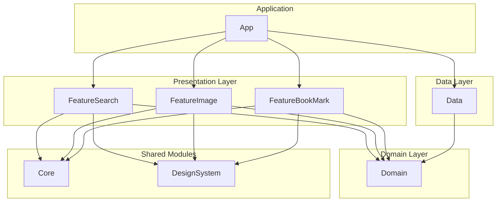

# iOSPortfolio 프로젝트 아키텍처 분석 보고서

## 1. 프로젝트 개요

이 문서는 `iOSPortfolio` 프로젝트의 기술적 구조와 아키텍처에 대해 설명합니다.

본 프로젝트는 책과 이미지를 검색하고, 원하는 항목을 북마크로 관리하는 기능을 제공하는 iOS 애플리케이션입니다. `Tuist`를 사용하여 프로젝트를 여러 개의 독립적인 모듈로 분리하여 관리함으로써, 빌드 시간 단축, 코드 재사용성 증대, 명확한 기능 분리 등의 이점을 추구합니다.

## 2. 핵심 아키텍처

프로젝트는 **모듈러 아키텍처(Modular Architecture)** 와 **클린 아키텍처(Clean Architecture)** 를 기반으로 설계되었습니다.

### 2.1. 모듈러 아키텍처

`Tuist`를 통해 프로젝트를 기능과 역할에 따라 여러 개의 프레임워크(Framework)로 분리했습니다. 각 모듈은 독립적으로 개발 및 테스트가 가능하며, 의존성 관계가 명확하게 관리됩니다.

주요 모듈 구성은 다음과 같습니다.

-   `App`: 애플리케이션 실행을 위한 최종 타겟
-   `Feature*`: 각 기능별 UI와 로직 (e.g., `FeatureSearch`, `FeatureImage`)
-   `Domain`: 핵심 비즈니스 로직 및 모델
-   `Data`: 데이터 소스(API, DB) 처리
-   `Core`: 공통 유틸리티 및 확장 기능
-   `DesignSystem`: UI 컴포넌트 및 스타일

### 2.2. 클린 아키텍처

클린 아키텍처의 핵심 원칙인 **의존성 규칙(The Dependency Rule)** 을 적용하여 계층을 분리했습니다. 이를 통해 내부 계층(Domain)은 외부 계층(Data, Feature)에 대해 알지 못하는 구조를 만들어 유연성과 테스트 용이성을 높였습니다.

-   **Presentation Layer**: `Feature*` 모듈. UI와 사용자 입력을 처리하며, MVVM 패턴을 적용하여 View와 ViewModel로 역할을 분리합니다.
-   **Domain Layer**: `Domain` 모듈. 다른 어떤 계층에도 의존하지 않는 순수한 비즈니스 로직을 포함합니다. (Use Cases, Entities)
-   **Data Layer**: `Data` 모듈. `Domain` 계층의 인터페이스(Repository)를 구현하며, 실제 데이터의 출처(네트워크, 로컬 DB)를 다룹니다.

## 3. 모듈별 상세 설명

| 모듈명              | 역할                                                                                                                            | 주요 기술/패턴                  |
| ------------------- | ------------------------------------------------------------------------------------------------------------------------------- | ------------------------------- |
| **`App`**           | - 앱의 진입점(Entry Point) - 각 모듈의 의존성 주입 및 초기 화면 설정 - 탭바(TabBar)를 통해 주요 기능(Feature)들을 연결      | `SwiftUI`, `Coordinator`  |
| **`FeatureSearch`** | - 책 검색 기능 - 검색어 입력, 검색 결과 표시, 상세 화면 이동 등의 UI 및 로직 포함                                             | MVVM, `RxSwift`, `Coordinator`  |
| **`FeatureImage`**  | - 이미지 검색 기능 - 검색 결과 표시 및 상세 이미지 보기 기능                                                                 | MVVM, `SwiftUI`, `Combine`      |
| **`FeatureBookMark`**| - 북마크 관리 기능 - 저장된 북마크 목록 조회 및 삭제 기능                                                                    | MVVM, `RxSwift`                 |
| **`Domain`**        | - 앱의 핵심 비즈니스 규칙과 데이터 모델 정의 - `Entities`: 순수한 데이터 구조 - `UseCases`: 비즈니스 로직 - `Repository` Interfaces: 데이터 저장소 추상화 | `Entities`, `UseCases`          |
| **`Data`**          | - `Domain`의 Repository 인터페이스 구현 - `APIClient`: 네트워크 통신 - `LocalRepository`: 로컬 데이터베이스(Realm) 관리 | `Alamofire`, `RealmSwift`       |
| **`Core`**          | - 여러 모듈에서 공통으로 사용되는 기능 - `String`, `Date` 등 Foundation 확장 - `WebView` 등 공통 View 컴포넌트             | `Extensions`, `Utilities`       |
| **`DesignSystem`**  | - 앱의 일관된 UI/UX를 위한 요소 - `Color`, `Font`, `CustomView`, 아이콘 등 리소스 관리                                         | `UIColor`, `UIFont`, `Components` |

## 4. 의존성 관계

모듈 간 의존성은 단방향으로 흐르며, 클린 아키텍처의 의존성 규칙을 따릅니다.

-   **`App`** 모듈은 각 `Feature` 모듈과 `Data` 모듈을 의존하여 전체 앱을 조립하고 의존성을 주입합니다.
-   **`Feature`** 모듈들은 `Domain`(비즈니스 로직), `Core`(공통 기능), `DesignSystem`(UI)을 의존합니다.
-   **`Data`** 모듈은 `Domain`의 추상화된 인터페이스를 구현하기 위해 `Domain`을 의존합니다.
-   **`Domain`** 모듈은 프로젝트 내 다른 어떤 모듈도 의존하지 않습니다.

## 5. 주요 외부 라이브러리

| 라이브러리          | 사용 목적                               |
| ------------------- | --------------------------------------- |
| **`Tuist`**         | 프로젝트 모듈화 및 관리                 |
| **`RxSwift`**       | 비동기 이벤트 처리를 위한 반응형 프로그래밍 |
| **`Alamofire`**     | HTTP 네트워킹                           |
| **`Kingfisher`**    | 이미지 다운로드 및 캐싱                 |
| **`RealmSwift`**    | 로컬 데이터베이스                       |
| **`SnapKit`**       | Auto Layout을 코드로 쉽게 작성하기 위한 DSL |
